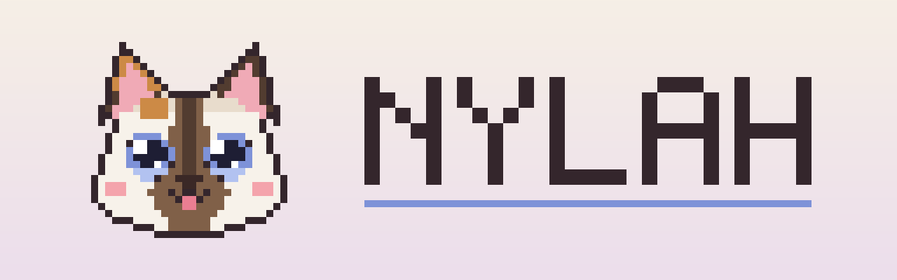

<p align="center"></p>

<p align="center">
  
  
  
  
</p>

**Nylah** is a tortie-point Siamese who keeps you company in Minecraft.

She follows you around, sits beside you when you stop, looks up at you with her big blue eyes, weaves round your legs, bleps, stretches, rolls onto her back and purrs when you stroke her. She is entirely client-side: only you can see her, and the server never knows she exists.

## What she does

- **Follows you** at a walk, a trot or a run, finding her way round walls, hopping up steps and keeping her paws out of water. If you get too far ahead, she pads in from just out of sight. She never pops into view.
- **Looks up at you.** When you are close, she tips her chin right back to look at you, eyes wide.
- **Rubs against your legs.** Stand still for a bit and she weaves a figure of eight round your feet, tail hooked round your shin.
- **The blep.** Sometimes the tip of her tongue just stays out, even when she is asleep.
- **Slow blinks.** Look at her for a while and she slow-blinks back.
- **Head bonks.** Crouch near her and she comes over to bonk you.
- **Settles down** when you stop: she stands, then sits, then loafs, then naps curled up or sunbathes on her side.
- **Lots more:** stretches (front, back and the full-length reach), rolling on her back, the belly-up reach, washing her face, grooming, yawning, kneading, trilling hello, meowing (upside down too), head tilts, looking back over her shoulder, cheek rubs, pounces, sneezes and the odd burst of zoomies.
- **Strokes.** Right-click her with an empty hand. Scratch her head and she leans in with her eyes closed; stroke her back and she purrs.
- **Waits for you** while you fly, swim or ride, sitting and watching you, and curls up beside you when you sleep.

## Controls

| Key | What it does |
|---|---|
| **N** | Nylah's menu: ask her to do any of her things, and her settings |
| **H** | Call her: she runs over, chirps and looks up at you |
| Right-click (empty hand) | Stroke her |

There are also unbound keys for *something cute* and *nap / wake*. All of them can be changed under **Options → Controls → Nylah**.

In her menu you can set her texture detail (**2x** by default, or **4x** / **8x**), whether her name shows (**always**, **when you look at her**, or **hidden**), her sound volume (full by default), and how lively she is.

## Install

She works on **Mac and Windows** (and Linux), in any Fabric instance of Minecraft 26.1 to 26.1.2 or 26.2, such as **Fabulously Optimized** in CurseForge (13.x is 26.1.2, 14.x is 26.2). There is one jar for each:

| Your Minecraft | Download |
|---|---|
| 26.1, 26.1.1, 26.1.2 | `nylah-1.0.4+26.1.jar` |
| 26.2 | `nylah-1.0.4+26.2.jar` |

1. Download the jar for your Minecraft from the [latest release](https://github.com/CammyCodes/Nylah/releases/latest).
2. Put it in your instance's `mods` folder. In CurseForge: right-click the instance, choose **Open Folder**, then open `mods`.
3. Start Minecraft.

She has no other dependencies and does not need Fabric API, although she works fine alongside it.

### Or let Claude install her

If you have [Claude Code](https://claude.com/claude-code) (or the Claude desktop app with Claude Code), paste this in and it will find your CurseForge instance, download her, check the download and install her. It only ever touches Nylah's own file.

```text
Please install the Minecraft mod "Nylah" into my CurseForge Minecraft instance on this computer. Work carefully and only touch what is described here.

1. Find my CurseForge instances. On a Mac they are normally in ~/Documents/curseforge/minecraft/Instances/ and on Windows in %USERPROFILE%\curseforge\minecraft\Instances\. If they are not there, look for a folder called "Instances" inside a "curseforge/minecraft" folder in my home folder. Every instance folder contains a minecraftinstance.json file.

2. For each instance, read minecraftinstance.json and note its "name", "gameVersion" and "baseModLoader" -> "name". Nylah needs the Fabric loader (the loader name starts with "fabric-") and Minecraft 26.1, 26.1.1, 26.1.2 or 26.2, for example Fabulously Optimized 13 (26.1.2) or Fabulously Optimized 14 (26.2). Any other Minecraft version is not compatible yet. Show me a short list of the instances you found and which ones are compatible. If exactly one is compatible, use it. If more than one is, ask me which one. If none are, stop and explain why. Do not install, update or change any modpack, loader or other mod.

3. Check that Minecraft is not running from that instance (look for a running java process whose command line contains that instance's folder). If it is running, ask me to quit Minecraft, and wait until I say it is closed.

4. Download the latest Nylah release. Get the release details from https://api.github.com/repos/CammyCodes/Nylah/releases/latest. There is one jar per Minecraft version: for Minecraft 26.1, 26.1.1 or 26.1.2 use the asset whose name ends in "+26.1.jar", and for Minecraft 26.2 use the asset whose name ends in "+26.2.jar". Download that jar and the asset with the same name plus ".sha256" into a temporary folder. Check the jar's SHA-256 (on a Mac: shasum -a 256 <file>; on Windows: Get-FileHash <file> -Algorithm SHA256) against the value in the .sha256 file. If they do not match, stop and tell me.

5. In that instance's "mods" folder, delete any older Nylah jars, named like nylah-1.0.1.jar or nylah-1.0.2+26.1.jar (only files that start with "nylah-" and end in ".jar"; there must never be two), then copy the new jar in. Do not touch anything else in the mods folder or anywhere else in the instance.

6. Show me the nylah jar now in the mods folder and its SHA-256, so I can see it worked.

7. Finally, tell me: start Minecraft from CurseForge as usual and join any world; Nylah, a little Siamese cat, will come and find me. Press N for her menu (everything she can do, plus settings), press H to call her, and right-click her with an empty hand to stroke her.
```

## Building

Needs JDK 25.

```bash
./gradlew build
```

```bash
./gradlew build -Pmc=26.2
```

The first builds the Minecraft 26.1 jar, the second the 26.2 one; both are written to `build/libs/`. `./gradlew test` runs the tests, which cover her animations, pathfinding, click handling, and a bytecode audit confirming the mod can never send anything to a server.

Her model, coat, animations and logo are generated by the scripts in `tools/` (Python 3 with Pillow and NumPy). `tools/preview` is a browser viewer for her model and every animation.

## Licence

The code is [MIT](LICENSE). Nylah's artwork and likeness (her texture, model design, logo and banner) are **all rights reserved**; see [ASSETS-LICENSE.md](ASSETS-LICENSE.md).
